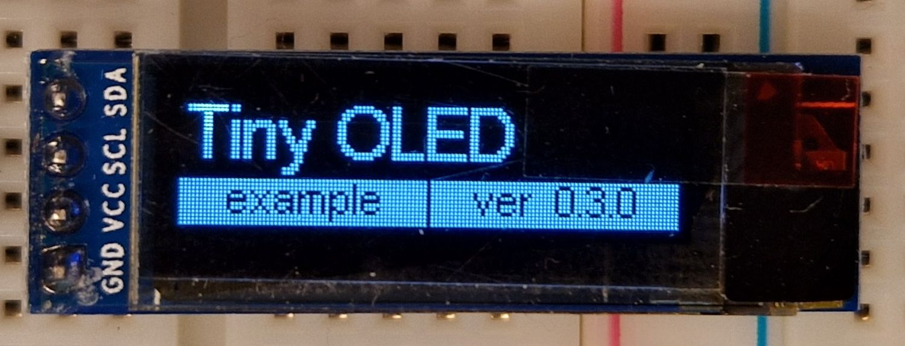

# Tiny OLED (toled)

Tiny OLED driver.


## Introduction

The aim of this driver is to use few source files, not to be portable.
It is intended for

- OLEDs with a resolution of 128×32.
- OLEDs using I2C communication.
- Written for ESP32S3

The user of the library has to configure I2C pins and speed.
Note the OLED supports clocks up to 1MHz, but other I2C devices on the same bus might not. 

```c++
  Wire.begin(8,18,1000000); // SDA, SCL, freq
  toled_init();
```


## Notes

- Coordinates are from (0,0)-(127,31).

- Endpoint (of lines, rectangles) are inclusive, so (0,0)-(127,31) fills entire screen.

- It is suggested to use an I2C speed of 1 000 000 (see `toled-speed.ino` example).

- On an ESP32S3, with I2C bus at 1MHz, a `commit()` (sending pixels from ESP to OLED) 
  takes 6000 us. Drawing a rectangle takes 45us, drawing some text takes 340 us.
  See `toled-speed.ino` example for the measurement.




## Revision history

For revision history see [src/toled.h](`toled.h`).


## Trace

The [Saleae trace](extra/trace.sal) shows the configuration stage.


(end)
